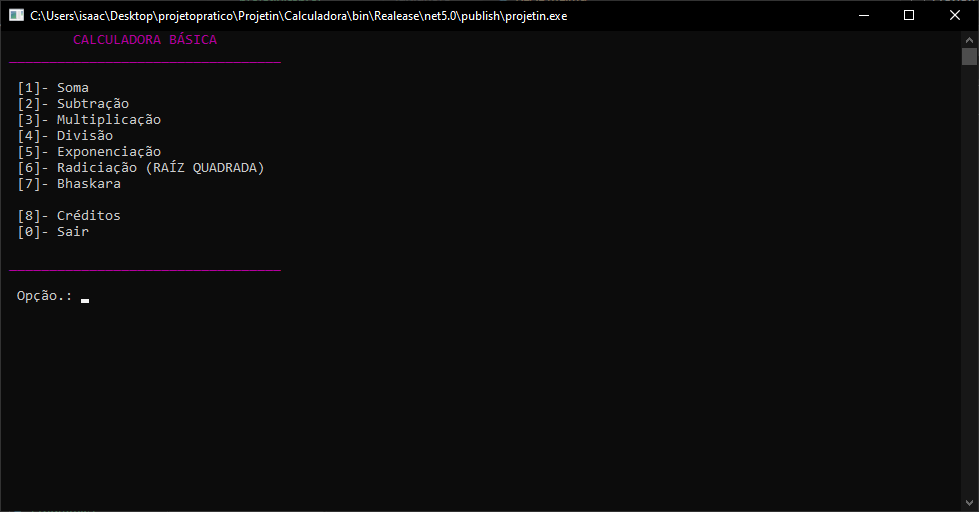

# Calculadora

Este software exibe um menu com opções para cálculos aritméticos. Ao selecionar uma opção, o usuário pode fazer cálculos, e assim será retornado o resultado.


## Exemplos


```
        CALCULADORA BÁSICA        
 __________________________________ 

  [1]- Soma
  [2]- Subtração
  [3]- Multiplicação
  [4]- Divisão
  [5]- Exponenciação
  [6]- Radiciação (RAÍZ QUADRADA)
  [7]- Bhaskara

  [8]- Créditos
  [0]- Sair

 __________________________________

Opção..: 1
```

```
  - SOMA -        

Digite o PRIMEIRO número..: 5
Digite o SEGUNDO número..: 5

A SOMA entre os números 5 e 5 é 10


Pressione alguma tecla...
```


## _Screenshot_




## _Download_

Baixe o arquivo abaixo. Descompacte na pasta desejada.


[🗃 Download do arquivo .zip](dist/Calculadora.zip)

Execute utilizando o comando:

```
 dotnet projetin.dll
```

## Agradecimentos

- [Etec Adolpho Berezin](http://eteab.com.br/)
- [Prof Ermogenes](https://github.com/ermogenes)
- [Dev C#](https://github.com/isaacgeazy/Calculadora)


Todos os direitos reservados. PIRATARIA É CRIME.